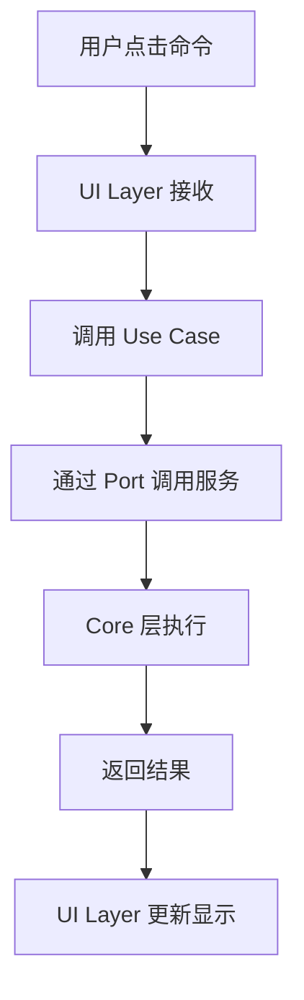
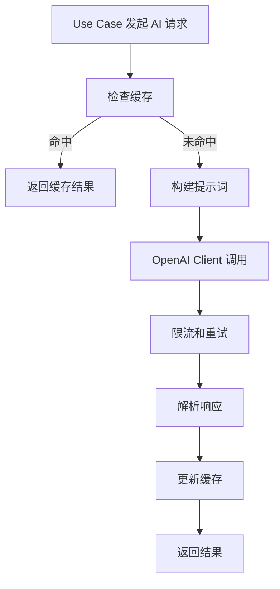

# 架构设计文档

## 🏗️ 整体架构

AI Explorer 采用**分层模块化架构**，确保高内聚、低耦合，支持模块独立开发和测试。

```
┌─────────────────────────────────────────────────────┐
│                   VS Code Extension                  │
├─────────────────────────────────────────────────────┤
│  UI Layer (TreeView, Webview, Commands)             │
├─────────────────────────────────────────────────────┤
│  Application Layer (Use Cases, Services)            │
├─────────────────────────────────────────────────────┤
│  Domain Layer (Entities, Ports)                     │
├─────────────────────────────────────────────────────┤
│  Infrastructure Layer (API, Cache, Storage)         │
├─────────────────────────────────────────────────────┤
│  Core Layer (DI, Logging, AI Client)               │
└─────────────────────────────────────────────────────┘
```

## 🎯 设计原则

### 1. 洋葱架构（Clean Architecture）

- **外层依赖内层**：UI → Application → Domain ← Infrastructure
- **依赖反转**：通过接口（Ports）解耦具体实现
- **单一职责**：每层专注自己的职责

### 2. 模块边界清晰

```typescript
// 模块依赖图
Core ← Features (Explorer-Alias, UML-Canvas) ← UI
  ↑
Shared
```

- **禁止跨模块直接依赖**：Features 之间不能互相导入
- **通过 Core 和 Shared 通信**：共享功能放在 Core，共享类型放在 Shared

### 3. 依赖注入（DI）

所有服务通过 DI 容器管理，支持：
- **单例模式**：OpenAI 客户端、缓存服务
- **工厂模式**：用例类、业务服务  
- **实例注入**：VS Code Context

## 📁 目录结构详解

### Core 层 - 基础设施

```
src/core/
├── di/
│   └── Container.ts          # 依赖注入容器
├── ai/  
│   ├── OpenAIClient.ts       # AI 服务统一入口
│   └── PromptProfiles.ts     # 提示词模板管理
├── cache/
│   └── KVCache.ts           # 键值缓存服务
└── logging/
    └── Logger.ts            # 结构化日志服务
```

**职责**：
- 🔌 AI 服务接入和限流
- 💾 数据缓存和持久化
- 📝 日志记录和调试
- 🏗️ 依赖注入和服务管理

### Features 层 - 业务模块

#### Explorer-Alias 模块

```
src/features/explorer-alias/
├── ExplorerAliasModule.ts    # 模块入口和生命周期
├── ui/                       # UI 表现层
│   ├── AIExplorerProvider.ts # TreeView 数据提供者
│   └── ExplorerTreeItem.ts   # 树节点定义
├── app/                      # 应用逻辑层
│   └── usecases/
│       └── TranslateBatchUseCase.ts  # 批量翻译用例
├── domain/                   # 领域层（待扩展）
│   ├── entities/            # 实体定义
│   └── ports/               # 接口定义  
└── infra/                   # 基础设施层（待扩展）
    ├── translators/         # 翻译器实现
    └── repositories/        # 数据存储实现
```

#### UML-Canvas 模块

```
src/features/uml-canvas/
├── UMLCanvasModule.ts        # 模块入口和生命周期
├── app/                      # 应用逻辑层
│   └── usecases/
│       └── GenerateUMLUseCase.ts    # UML 生成用例
├── panel/                    # Webview 面板管理
│   └── UMLCanvasPanel.ts     # 面板生命周期和通信
├── domain/                   # 领域层（待扩展）
└── webview/                  # 前端资源
    └── src/                  # 前端源码（Vue/React/Vanilla）
```

### Shared 层 - 共享组件

```
src/shared/
├── types/
│   └── index.ts             # 通用类型定义
└── base/
    └── BaseModule.ts        # 模块基类
```

## 🔄 数据流向

### 用户交互流



### AI 调用流



## 🔌 接口设计

### Core 服务接口

```typescript
// AI 服务接口
interface AIRequest {
    prompt: string;
    model?: string;
    temperature?: number;
    maxTokens?: number;
}

interface AIResponse {
    content: string;
    usage?: TokenUsage;
}

// 缓存服务接口  
interface CacheService {
    get<T>(key: string, moduleId: string): Promise<T | null>;
    set<T>(key: string, value: T, ttl?: number, moduleId?: string): Promise<void>;
    delete(key: string, moduleId: string): Promise<void>;
}
```

### 模块间通信

```typescript
// 通过事件总线（可选扩展）
interface ModuleEvent {
    type: string;
    source: string;
    data: any;
}

// 通过共享服务（当前方式）
// 各模块通过 Core 层服务间接通信
```

## 🛡️ 错误处理策略

### 分层错误处理

1. **UI 层**：用户友好的错误提示
2. **Application 层**：业务异常包装和重试
3. **Infrastructure 层**：技术异常捕获和日志
4. **Core 层**：系统级异常和兜底处理

```typescript
// 错误类型定义
class AIExplorerError extends Error {
    constructor(
        message: string,
        public code: string,
        public module: string,
        public cause?: Error
    ) {
        super(message);
    }
}

// 使用示例
throw new AIExplorerError(
    '翻译服务调用失败',
    'TRANSLATION_SERVICE_ERROR', 
    'explorer-alias',
    originalError
);
```

## 🧪 测试策略

### 测试金字塔

```
      ┌─────────────┐
     │ E2E Tests    │  VS Code Extension Tests
    ├───────────────┤  
   │ Integration    │   Module Integration Tests
  ├─────────────────┤
 │  Unit Tests      │    Use Cases, Services Tests
└───────────────────┘
```

### 模块独立测试

每个模块都应该能够独立测试：

```bash
# 只测试 Explorer-Alias 模块
npm test -- --testPathPattern=explorer-alias

# 只测试 UML-Canvas 模块  
npm test -- --testPathPattern=uml-canvas
```

## 📈 性能考虑

### 1. 懒加载

- 模块按需激活
- 大型依赖延迟加载
- Webview 资源按需加载

### 2. 缓存策略

```typescript
// 多级缓存
Memory Cache (快速) → VS Code Storage (持久) → AI API (昂贵)
```

### 3. 批处理优化

```typescript  
// 批量 AI 调用，减少网络请求
await aiClient.batchProcess(files, translateFile, batchSize: 3);
```

## 🔮 扩展规划

### 新模块添加

1. 在 `src/features/` 创建新模块目录
2. 实现 `BaseModule` 接口
3. 在 `extension.ts` 注册模块
4. 更新 `tsconfig.json` 项目引用
5. 配置 ESLint 边界规则

### 新功能类型

- 📊 **代码度量模块**：代码复杂度分析
- 🔍 **智能搜索模块**：语义化代码搜索  
- 🤖 **AI 助手模块**：对话式编程助手
- 📚 **文档生成模块**：自动 API 文档生成

---

> 💡 **设计哲学**：保持简单、保持模块化、保持可测试性。每个模块都应该能够独立开发、独立部署、独立测试。