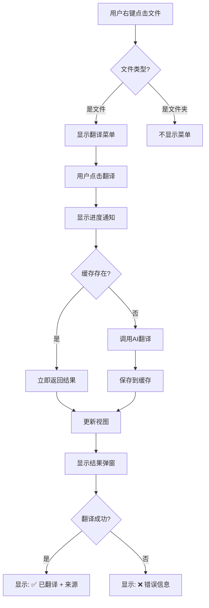

# 右键单独翻译文件 - 快速参考

## 🎯 一图看懂

```
用户交互层
    ↓
┌─────────────────────────────────────────────┐
│  3种触发方式                                  │
├─────────────────────────────────────────────┤
│  1️⃣ AI Explorer 右键                         │
│     📄 文件节点 → 右键菜单                     │
│                                             │
│  2️⃣ 原生资源管理器右键                         │
│     📂 任意文件 → 右键菜单                     │
│                                             │
│  3️⃣ 命令面板                                 │
│     Ctrl+Shift+P → 搜索命令                  │
└─────────────────┬───────────────────────────┘
                  ↓
┌─────────────────────────────────────────────┐
│  命令执行                                     │
│  aiExplorer.translateThisFile               │
└─────────────────┬───────────────────────────┘
                  ↓
┌─────────────────────────────────────────────┐
│  参数解析 (resolveToFileUri)                 │
│  ✓ vscode.Uri                               │
│  ✓ 字符串路径                                │
│  ✓ 活动编辑器                                │
│  ✓ 节点对象                                  │
└─────────────────┬───────────────────────────┘
                  ↓
┌─────────────────────────────────────────────┐
│  翻译链路                                     │
│  1. 检查缓存 ⚡ <10ms                         │
│  2. 查询词典 ⚡ <5ms                          │
│  3. 应用规则 ⚡ <10ms                         │
│  4. 调用 AI ⚡⚡⚡ 500-2000ms                   │
└─────────────────┬───────────────────────────┘
                  ↓
┌─────────────────────────────────────────────┐
│  结果处理                                     │
│  ✓ 更新树视图                                │
│  ✓ 显示翻译结果                               │
│  ✓ 记录来源信息                               │
│  ✓ 保存到缓存                                │
└─────────────────────────────────────────────┘
```

## 🔑 核心代码位置

```typescript
// 1. 命令定义
📄 package.json:106-110
{
  "command": "aiExplorer.translateThisFile",
  "title": "AI 资源管理器：翻译此文件（仅此文件）"
}

// 2. 菜单配置
📄 package.json:149-157
{
  "when": "view == aiExplorer && (viewItem == file || viewItem == fileHasAlias)",
  "command": "aiExplorer.translateThisFile"
}

// 3. 命令注册
📄 ExplorerAliasModule.ts:142-146
this.registerCommand(context, 'aiExplorer.translateThisFile', async (item) => {
    await this.treeProvider?.translateThisFile(item);
});

// 4. 翻译实现
📄 AIExplorerProvider.ts:333-420
async translateThisFile(input?: any): Promise<void> {
    // 参数解析 → 验证 → 翻译 → 更新 → 提示
}
```

## ⚡ 快速命令

| 操作 | 快捷方式 | 说明 |
|------|---------|------|
| **翻译此文件** | 右键 → 翻译此文件 | 单文件翻译 |
| **清除缓存** | 右键 → 清除节点缓存 | 重置翻译 |
| **复制别名** | 右键 → 复制别名 | 复制到剪贴板 |
| **重命名文件** | 右键 → 用别名重命名 | ⚠️ 真实重命名 |
| **刷新视图** | 工具栏 → 🔄 | 刷新树视图 |
| **切换显示** | 工具栏 → 👁️ | 原名/别名切换 |

## 🎨 用户体验流程



## 📊 性能对比

```
操作类型          | 耗时       | 网络请求 | 用户体验
-----------------|-----------|---------|----------
缓存命中          | <10ms     | 否      | ⭐⭐⭐⭐⭐
词典查询          | <5ms      | 否      | ⭐⭐⭐⭐⭐
规则匹配          | <10ms     | 否      | ⭐⭐⭐⭐⭐
AI翻译（首次）    | 500-2000ms| 是      | ⭐⭐⭐
批量翻译（100文件）| 30-60s    | 是      | ⭐⭐
```

## 🔍 故障排查速查

| 问题 | 可能原因 | 解决方案 |
|------|---------|---------|
| **右键没菜单** | contextValue未设置 | 重启扩展(F5) |
| **翻译失败** | AI服务未配置 | 运行"检查AI状态" |
| **结果是回退** | 缓存+词典无结果 | 设置API Key |
| **速度很慢** | 首次AI调用 | 正常，后续会快 |
| **视图未更新** | 未刷新 | 点击刷新按钮🔄 |

## 📝 最佳实践

### ✅ 推荐做法

```
1. 新项目：先"翻译整个工作区"建立缓存
2. 新文件：右键"翻译此文件"
3. 不满意：清除缓存→重新翻译
4. 快速查看：切换别名显示模式
```

### ❌ 避免做法

```
1. 不要对文件夹使用"翻译此文件"
2. 不要频繁清除缓存（会重复调用AI）
3. 不要直接重命名文件（除非确认）
```

## 🎯 典型场景

### 场景1: 快速理解新项目

```
步骤：
1. 打开新项目
2. AI Explorer → 翻译整个工作区
3. 浏览文件树，查看中文别名
4. 快速理解项目结构
```

### 场景2: 翻译单个新文件

```
步骤：
1. 创建新文件 UserService.ts
2. 右键 → 翻译此文件
3. 查看别名：用户服务
4. 继续开发
```

### 场景3: 验证翻译质量

```
步骤：
1. 右键翻译文件
2. 查看弹窗的"来源"信息
   - AI → 新翻译
   - 缓存 → 已有翻译
   - 词典 → 标准翻译
3. 如不满意：清除缓存→重新翻译
```

### 场景4: 批量+单个混合

```
策略：
1. 第一次：批量翻译（建立缓存）
2. 后续：单个翻译（利用缓存）
3. 效率：95%的文件瞬间完成
```

## 🚀 下一步行动

```
[ ] 1. 按 F5 重启扩展
[ ] 2. 打开 AI Explorer 视图
[ ] 3. 右键任意文件测试
[ ] 4. 观察翻译结果和来源
[ ] 5. 试试清除缓存后重新翻译
[ ] 6. 在原生资源管理器中测试
[ ] 7. 阅读完整使用指南
```

---

📚 **相关文档**
- [详细使用指南](./右键单独翻译文件-使用指南.md)
- [架构设计说明](./右键单独翻译文件-架构说明.md)
- [实现总结](./右键单独翻译文件-实现总结.md)
